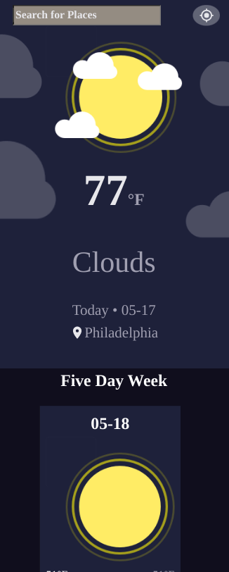
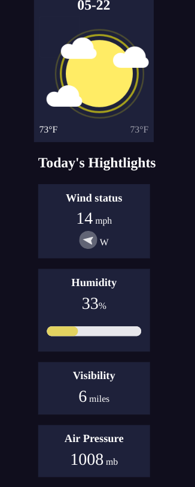
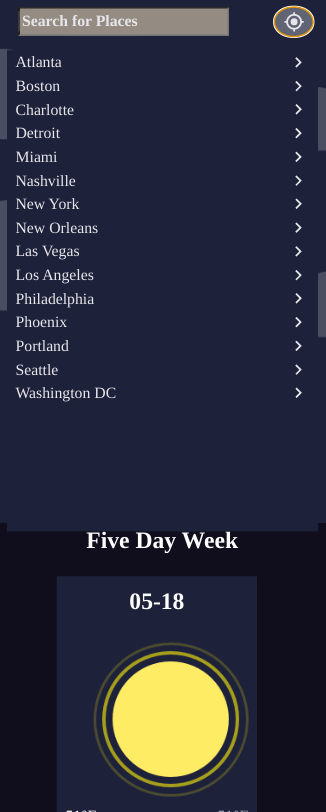
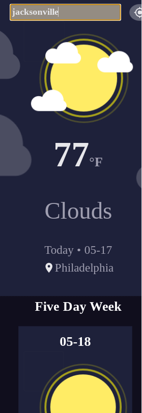
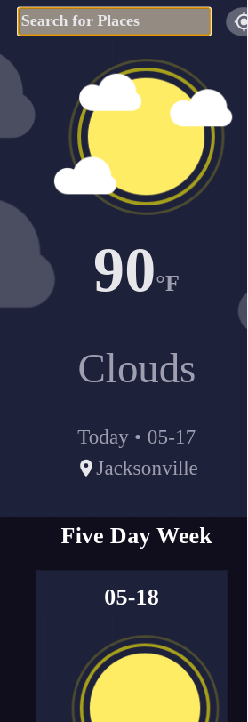
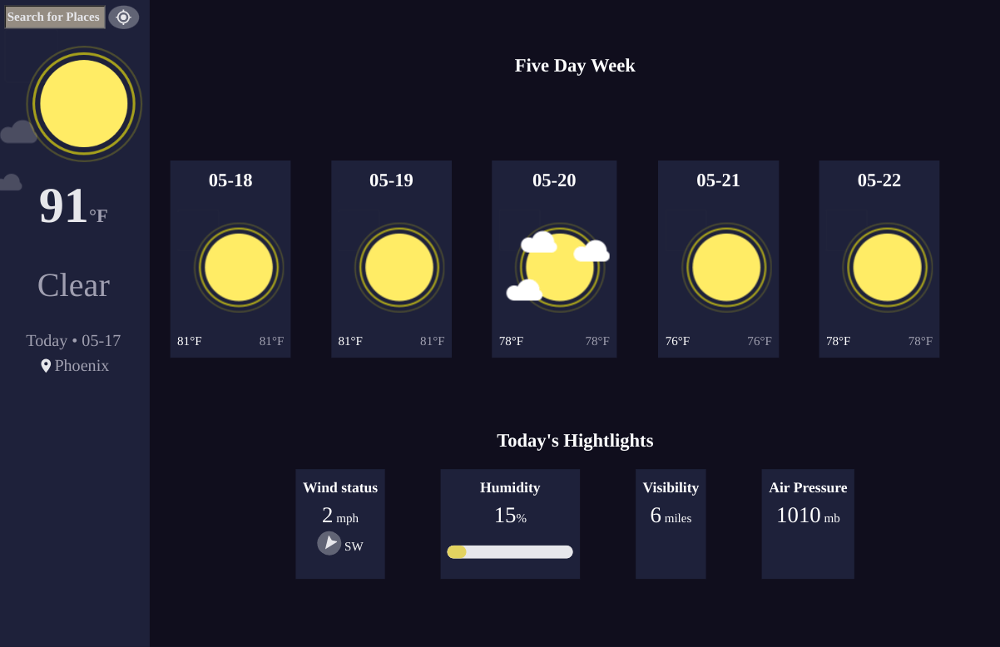
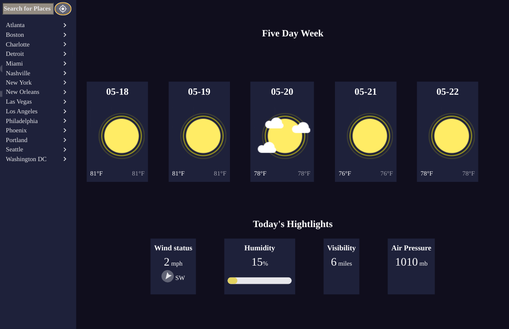

<h1 align="center">Angular Weather App</h1>

## Table of Contents

- [Screenshots](#screenshots)
- [Built With](#built-with)
- [How to use](#how-to-use)
- [Thoughts](#thoughts)
- [Useful Resources](#useful-resources)

## Screenshots















## Built With

- [Angular CLI](https://github.com/angular/angular-cli) version 13.3.5.
- [Angular](https://angular.io)
- [OpenWeatherMap Api](https://openweathermap.org/api)

## How To Use

To clone and run this application, you'll need [Git](https://git-scm.com) and [Node.js](https://nodejs.org/en/download/) (which comes with [npm](http://npmjs.com)) installed on your computer. From your command line:

```bash
# Clone this repository
$ git clone https://github.com/jdegand/angular-weather-app

# Install dependencies
$ npm install

# Add Api Key in environment.ts

# Run the app
$ npm start
```

## Thoughts

I based this off the [devchallenges weather app](https://legacy.devchallenges.io/challenges/mM1UIenRhK808W8qmLWv).

My ngIf's return the correct results but they add many extra empty divs.  This creates problems with using a grid wrapper.  Putting the 5 day forecast into a grid on mobile is not a good design choice anyway but it is in the devchallenges' design. I tried to add an else block to the conditions but that did not work.  It may be inheriting these empty divs from the prior loop of the weather list array.  The ngIf implementation does not completely supplant the ng-template implementation and this is disappointing.  Apparently, ng-template does not leave empty divs with comments in the html.    

```html
          <div *ngIf="item.weather[0].description === 'clear sky'">
            
          </div>
          <div *ngIf="item.weather[0].description === 'broken clouds'|| item.weather[0].description === 'scattered clouds' || item.weather[0].description === 'few clouds'">
            
          </div>
          <div *ngIf="item.weather[0].description === 'overcast clouds'">
            
          </div>
          <div *ngIf="item.weather[0].description === 'light rain'">
            
          </div>
          <div *ngIf="item.weather[0].description === 'heavy intensity rain' || item.weather[0].description === 'moderate rain' || item.weather[0].description === 'heavy rain'">
            
          </div>
```

Converting the design from the mobile to desktop was harder since I could not use grid.

I tried to limit my app to one initial network request.  The design requires multiple network requests - one for todays weather and another for the 5 day (possibly using a second component to get the five day forecast where you use a loading spinner until the request returns).  I didn't use the api required because I have been using the openweathermap api recently so it was quicker and less overhead to use that than learning another api while also being rusty at Angular.  

The 5 day forecast endpoint provides too many results.  I used a conditional to limit it to the 9:00 am forecast. Depending on the time of day, you may see today included in the 5 day forecast.  Another problem with this approach is that the min and max temperatures don't cover the whole day so they are often the same.  

I didn't try to convert to Celsius since I made my request in imperial units.  If a user toggled between celsius and fahrenheit, you could trigger another request (changing the units parameter) or you could convert the returned values to celsius with a function or even a custom pipe.    

I applied a filter to the background clouds by following a [CSS Tricks](https://css-tricks.com/apply-a-filter-to-a-background-image/) article.  You need a pseudo-element to add and filter just the background-image and not the inner contents.

The background image on desktop is hard to place identically to the mobile version.    It is really a lot of trial and error to get it right. Ideally, you'd have multiple different cropped backgrounds for mobile, tablet and desktop versions.   

I made a suggestions panel with cities.  I used buttons to make it keyboard accessible.  The devchallenges design has cities from various countries. The openweathermap api is US-centric so I used only US cities.

Openweathermap api has a new endpoint - "one-call".  This api endpoint could potentially help fix the min and max problem.   

## Useful Resources

- [Steps to replicate a design with only HTML and CSS](https://devchallenges-blogs.web.app/how-to-replicate-design/)
- [Reactgo](https://reactgo.com/angular-change-favicon/) - favicon
- [Unicode Table](https://unicode-table.com/en/00B0/) - degree
- [CSS Tricks](https://css-tricks.com/apply-a-filter-to-a-background-image/) - filter to background image
- [YouTube](https://www.youtube.com/watch?v=n2OL8BXJyZI) - metaweather api vanilla js
- [YouTube](https://www.youtube.com/watch?v=psZXU8PTAS8) - Angular Weather App Tutorial
- [Github](https://github.com/shimphillip/openweathermap-ts/blob/master/src/types/ThreeHourResponse.ts) - used to help model forecast data
- [JSON Formatter](https://jsonformatter.curiousconcept.com/#)
- [JSON to Typescript](https://transform.tools/json-to-typescript)
- [Stack Overflow](https://stackoverflow.com/questions/22091733/dynamically-transform-in-css-using-ng-style) - inline styles with variables
- [Stack Overflow](https://stackoverflow.com/questions/45507970/how-can-i-change-the-color-of-a-progress-bar-value-in-html) - progress bar css
- [Stack Overflow](https://stackoverflow.com/questions/4461942/html-tags-inside-label) - nesting with label tags
- [Stack Overflow](https://stackoverflow.com/questions/38110614/us-ngfor-for-json-object-with-nested-arrays) - ngfor nested arrays
- [Medium](https://medium.com/swlh/filtering-an-array-of-nested-arrays-and-objects-using-angular-pipes-611af3b356f0) - filtering a nested array
- [Stack Overflow](https://stackoverflow.com/questions/30869370/ng-if-with-angular-for-string-contains) - ngIf includes
- [Snowfence](http://snowfence.umn.edu/Components/winddirectionanddegrees.htm) - wind direction and degrees
- [YouTube](https://www.youtube.com/watch?v=F_B8w5MNJzg) - ngFor, switch etc
- [Stack Overflow](https://stackoverflow.com/questions/49632562/css-grid-as-child-of-flexbox-not-behaving-as-expected) - grid on flex children
- [Stack Overflow](https://stackoverflow.com/questions/59657033/angular-8-ngif-creates-empty-element-when-false) - ngIf empty element when false prevents grid for five day week section
- [Stack Overflow](https://stackoverflow.com/questions/64690819/module-build-failed-from-node-modules-postcss-loader-src-index-js) - the error thrown if background image path is wrong
- [Medium](https://medium.com/tech-insights/how-to-deploy-angular-apps-to-github-pages-gh-pages-896c4e10f9b4) - angular github pages
- [Stack Overflow](https://stackoverflow.com/questions/32659099/making-a-clickable-div-accessible-through-tab-structure) - role='button'
- [YouTube](https://www.youtube.com/watch?v=xJ45MGDAi6c) - Angular testing hurdles
- [Ievgen](https://ievgen.de/2020/11/06/running-angular-unit-tests-in-docker-container/) - angular unit in container
- [Stack Overflow](https://stackoverflow.com/questions/51489904/angular-6-should-i-put-secret-environment-variables-in-environment-ts-file) - environment files and git
